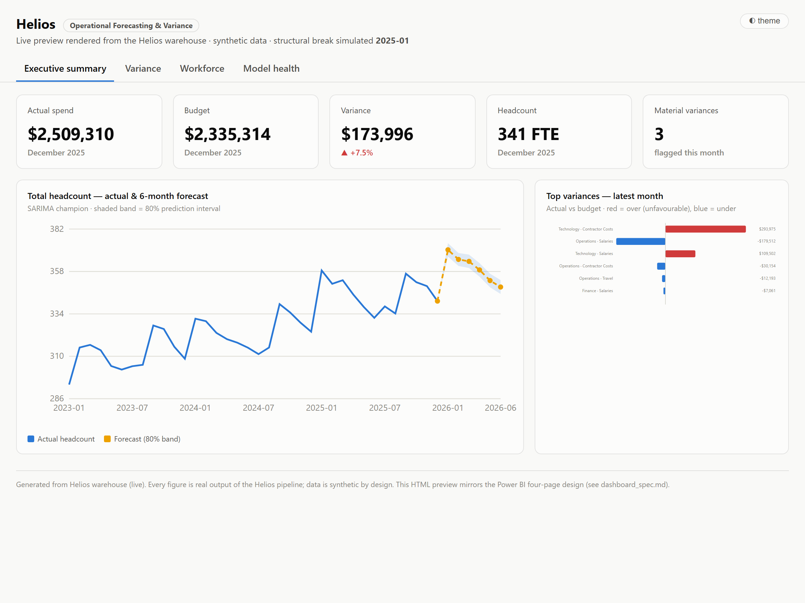

# Helios — Operational Forecasting & Variance Platform

Helios forecasts operational headcount and spend, tracks forecast-vs-actual
variance, explains that variance to business users, and detects when its own
forecasts start degrading — retraining itself when they do.

**Status: all 11 phases complete.** Synthetic multi-source data →
reconciliation/data-quality engine → star-schema warehouse (Type 2 SCD) →
forecasting with rolling-origin backtesting + MLflow → variance analysis with
driver attribution → MLOps drift detection with champion-challenger retraining →
Prefect orchestration → Power BI dashboard (DAX) → NL query agent → FastAPI
service + interactive explorer UI + threshold alerting → Docker + Azure IaC →
docs. **157 tests, all green;** CI runs the whole pipeline end to end. See the
[roadmap](#roadmap).

Run `uvicorn src.api.app:app` and open <http://127.0.0.1:8000> for the explorer:
filter by month and department, see what breached threshold and why, and query
the warehouse in plain English.



## The problem

Finance and operations teams build forecasts in Excel every quarter. Those
forecasts drift out of accuracy silently; nobody notices until a variance
report lands 18% off and a human spends days reconciling spreadsheets to find
out why. Helios automates the forecast, automates the variance explanation, and
monitors its own accuracy so degradation is flagged *before* the business is
surprised.

## Headline result

A simulated Q1-2025 reorganization shifts work out of Operations and into
Technology and contractors. A forecast trained before it degrades badly the
moment it lands — forecast error on Technology headcount jumps **17× (MAE 2.1
→ 35)**. Helios catches this automatically: concept-drift and performance-decay
monitors fire, retraining triggers, and a challenger trained through the change
is promoted only after beating the incumbent by **95%** on a held-out window.
The same event surfaces on the finance side as a **+80% contractor-cost
variance** in Technology, decomposed into volume, mix, and rate drivers — so a
business user sees not just *that* spend broke plan but *why*.

The whole story is visible on the four-page dashboard
([screenshots + DAX](powerbi/README.md)) rendered live from the warehouse.

## Honesty first

- **All data is synthetic**, produced by a seeded generator
  (`src/datagen`) modeling 36 months of a ~700-person organization: trend,
  hiring seasonality, noise, and a deliberate structural break at month 24.
  No real company data is used or implied. Because the generating process is
  known, model accuracy is reported against actual ground truth.
- The data's messiness is **engineered and documented**
  ([docs/data_dictionary.md](docs/data_dictionary.md)): duplicate rows, mixed
  FTE scales, department alias chaos, currency strings, missing periods, an
  incomplete cost-centre lookup, and contractor/employee double-counting.
  These defects are the test fixtures for the reconciliation engine.
- Known limitations: no real ERP integration; synthetic data is still cleaner
  than reality; single-tenant assumptions.

## What works today

```
# one-time setup
python -m venv .venv
.venv\Scripts\pip install -e ".[dev]"

# regenerate the three source systems (deterministic per seed)
python -m src.datagen --seed 42

# reconcile them into one trusted view + quarantine + QC scorecard
python -m src.reconciliation

# load the star-schema warehouse (SQLite default; HELIOS_WAREHOUSE_URL for Postgres)
python -m src.warehouse

# backtest all model families, track in MLflow, register champions
python -m src.forecasting            # add --no-prophet / --no-mlflow to go faster

# budget-vs-actual variance with volume/mix/rate driver attribution
python -m src.variance

# detect drift, trigger retraining, gate the challenger against the champion
python -m src.monitoring

# run the whole pipeline on a schedule (optional: pip install -e ".[orchestration]")
python -m flows.pipelines daily          # or weekly / monthly / serve

# render the Power BI preview dashboard from the warehouse
python -m powerbi.build_dashboard        # -> powerbi/dashboard.html

# ask the warehouse in plain English (guardrailed, read-only SQL)
python -m src.agent "Which department had the highest headcount last month?"
python -m src.agent.evaluate --stub      # golden-set accuracy + injection block rate

# serve the API + the interactive explorer UI at http://127.0.0.1:8000
uvicorn src.api.app:app --reload         # or: docker compose up --build

# evaluate alert thresholds and deliver the digest (file always; Slack/email if configured)
python -m src.alerting                   # --dry-run to preview, --test to verify channels

# export the star schema for Power BI Desktop (Get Data -> Folder)
python -m powerbi.export_model           # -> powerbi/model/*.csv

# run the test suite (157 tests)
python -m pytest

# inspect experiments
mlflow ui --backend-store-uri sqlite:///data/mlflow/mlflow.db
```

Example scorecard from a run:

```
hr         :   536 in ->   526 kept,  10 quarantined
contractor :   118 in ->   106 kept,  12 quarantined
financials :   712 in ->   568 kept, 144 quarantined
reasons: UNMAPPED_COST_CENTRE: 155, DUPLICATE_ROW: 10, CONTRACTOR_ALSO_EMPLOYEE: 1
period gaps: CC-300: 2024-02, 2025-06
```

Every number reconciles: **no record is ever silently dropped**. Excluded rows
land in a quarantine table with a reason code and full payload, and the engine
asserts `rows_in == rows_kept + rows_quarantined` on every run. The 144
quarantined financial rows are the CC-500 lookup gap doing exactly what it
should — surfacing as a finding instead of vanishing.

## Design decisions worth defending

- **Employee-level simulation, not aggregate sampling** — the HR roster,
  contractor roster, and financials are consistent projections of one
  underlying reality, so cross-system reconciliation is meaningful.
- **Budgets are built ignorant of the structural break** — set from trajectory
  at fiscal-year start, exactly how real budgets go stale, so post-break
  variance is genuine signal for Phase 5.
- **Quarantine over clamping/dropping** — an FTE of 250% is a source-system
  defect to surface, not a value to clamp to 1.0.
- **Unique names in ground truth** — any cross-system name collision is a
  deliberate double-count injection, never a coincidence, so entity-matching
  behavior is exactly testable.
- **Ground truth is quarantined from the pipeline** — evaluation-only files;
  reconciliation and (future) forecasting never read them.

## Natural-language querying

`python -m src.agent "..."` turns a question into validated, read-only SQL,
runs it, and returns the answer **plus the SQL and the tables it touched** — so
every answer is auditable. Generated SQL is parsed with sqlglot and rejected
unless it is a single `SELECT` against known tables with a row limit; `DROP`,
stacked queries, `ATTACH`, `sqlite_master` reads, and `load_extension` are all
blocked. The agent uses Claude when a credential is present and a deterministic
offline generator otherwise, so the guardrails and the golden-set evaluation
run in CI with no key. On the 30-question golden set the injection-block rate is
**100% by construction of the guardrails** (see [security](#security)).

## Explorer UI

`uvicorn src.api.app:app` serves a single-page explorer at `/` alongside the
API: month and department filters, headline KPIs, a headcount-vs-plan chart with
the structural break marked, the findings that breached threshold, a sortable
variance table, and the NL query box. No build step and no CDN — it is a static
file calling the documented endpoints, so the page cannot drift from the API.

Two details worth calling out, because both are places a dashboard usually lies:

- **Departments with no spend are still selectable.** Sales' financial rows were
  quarantined by the CC-500 lookup gap, so it has headcount but no cost. Hiding
  it would hide the finding; instead the page says why the numbers are blank.
- **Negative vacancy is relabelled**, not shown as `-11 FTE vacant`. Staffed
  above plan is a different condition, not a negative amount of the same one.

## Alerting

Thresholds are evaluated against the variance report and the drift report, and
the digest is delivered to whatever is configured:

```
python -m src.alerting --dry-run     # preview
python -m src.alerting --test        # verify channel wiring, no evaluation
python -m src.alerting               # evaluate + deliver
```

- **The file channel is always on.** Every alert lands in `data/alerts/` before
  any remote delivery is attempted, so a webhook outage cannot make an alert
  disappear. Remote failures are reported, never raised into the pipeline.
- **The net-variance rule needs both a percentage and a dollar bar** — a 40%
  miss on a $3k line is noise, and $120k on a $40M budget is rounding.
- **Drift with no promoted challenger is `critical`**, above a successful
  retrain: it means the degraded model is still serving.
- The UI's "needs attention" panel calls the same rules, so the page and the
  emails cannot disagree.

Slack, Resend, and SMTP are supported; see `.env.example`. Nothing is enabled
until its config is complete, because a half-configured channel that silently
does nothing is harder to debug than an obviously absent one.

## Security

- **No secrets in the repo** — env-based config, gitignored `.env`, `.env.example`
  documents the shape; the Azure DB URL lives only in Key Vault and is injected
  as a secret reference.
- **No SQL string-building** — SQLAlchemy with fixed statements everywhere; the
  NL agent's generated SQL passes an AST-level guardrail (parse, not regex)
  before execution, then runs as read-only with a statement timeout.
- **Generated data is gitignored** — even synthetic PII-shaped data (names,
  salaries) never enters git history; it is reproducible from the seed instead.
- **Ground truth is quarantined from the pipeline** — evaluation-only, never read
  by reconciliation or forecasting, so accuracy claims stay honest.
- The API is **read-only by design**; the container runs as a **non-root** user.

Details in [docs/architecture.md](docs/architecture.md).

## What's honest about this project

- **The data is synthetic**, stated everywhere. No real company data is used or
  implied. Because the generating process is known, accuracy is reported against
  real ground truth, and failures are reported too (Prophet lost on every target;
  SARIMA diverged on aggregate spend — see `docs/modeling_decisions.md`).
- **Not provisioned to a live cloud.** The Azure infrastructure is real,
  correct Bicep and a working CI/CD workflow, but provisioning needs an Azure
  account and spend; it has not been stood up. The app is verified running
  locally (`uvicorn`, health 200/503) and the container build is defined but not
  pushed.
- **The Power BI `.pbix` is assembled in Power BI Desktop** (a GUI step). The
  DAX measure library, the semantic model, and the four-page design are real and
  committed; the HTML dashboard is a faithful live preview of them.
- **Limitations**: no real ERP integration; synthetic data is cleaner than
  reality; single-tenant assumptions.

## Roadmap

All phases complete. Remaining work that needs credentials or a GUI — real-data
ingestion, cloud deploy, `.pbix` assembly — is written up step by step in
[docs/next_steps.md](docs/next_steps.md).

See [docs/architecture.md](docs/architecture.md) for the
system diagram and [DEMO.md](DEMO.md) for a 90-second walkthrough script.

| Phase | Scope | Status |
|---|---|---|
| 1 | Synthetic multi-source data generator | ✅ |
| 2 | Ingestion, reconciliation, quarantine, QC scorecard | ✅ |
| 3 | Star schema, Type 2 SCD, idempotent loads (SQLite/Postgres) | ✅ |
| 4 | SARIMA / Prophet / XGBoost + rolling-origin backtesting + MLflow | ✅ |
| 5 | Variance analysis with volume/rate/mix decomposition | ✅ |
| 6 | PSI/KS drift detection, champion-challenger auto-retraining | ✅ |
| 7 | Orchestration (Prefect) | ✅ |
| 8 | Power BI dashboard (DAX, semi-additive measures) | ✅ |
| 9 | NL query agent (Claude, validated read-only SQL, golden-set eval) | ✅ |
| 10 | FastAPI service, Docker, Azure IaC, CI/CD | ✅ |
| 11 | Docs + demo script | ✅ |

## Tech stack

**Data/ML:** Python 3.11+ · pandas · NumPy · statsmodels (SARIMA) · Prophet ·
XGBoost · MLflow · SQLAlchemy (SQLite dev / PostgreSQL prod) · sqlglot.
**Serving/infra:** FastAPI · Docker · Azure (Container Apps, PostgreSQL, Blob,
Key Vault) as Bicep · Prefect · GitHub Actions.
**BI/LLM:** Power BI (DAX) · Anthropic Claude. **Testing:** pytest (157 tests).

## Skills demonstrated

Advanced Excel (PivotTable-equivalent SUMIFS/XLOOKUP in the HR workbook) ·
SQL & dimensional modeling (star schema, Type 2 SCD, idempotent loads) · data
quality & reconciliation with explicit quarantine · time-series forecasting with
rolling-origin backtesting · statistics implemented from first principles
(PSI, KS, prediction intervals) · budgeting/variance analysis with volume/rate/mix
decomposition · MLOps (drift detection, champion-challenger retraining) ·
pipeline orchestration · Power BI + DAX · LLM integration with guardrails and a
measured evaluation harness · containerization, IaC, and CI/CD · technical
documentation.
