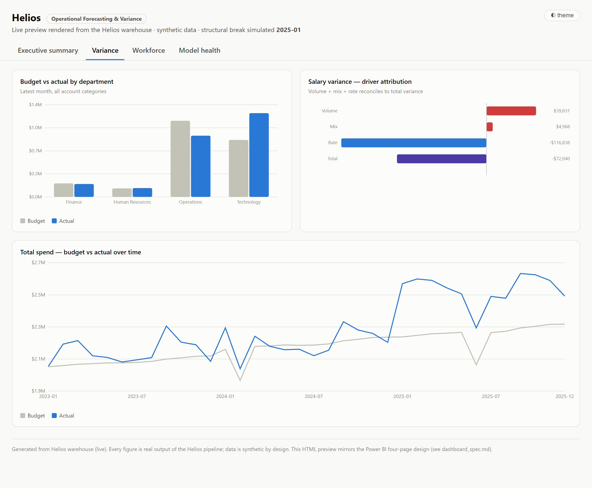
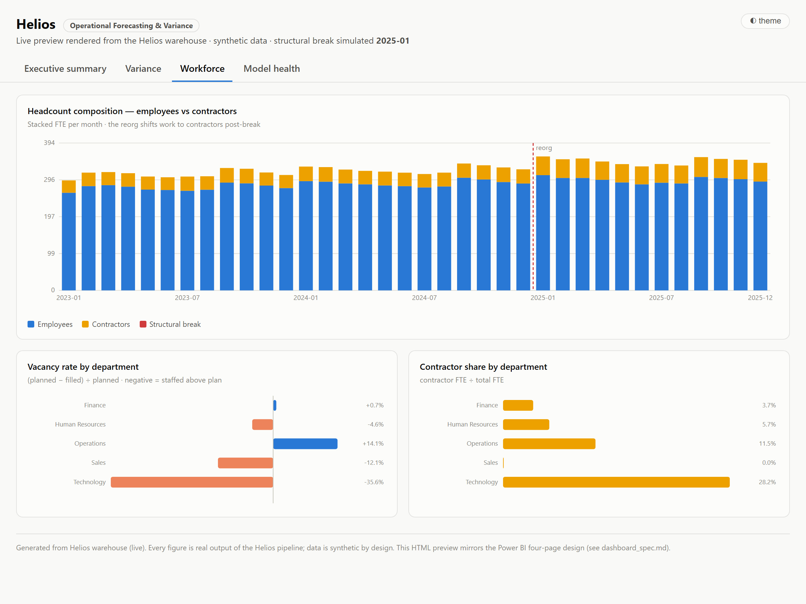
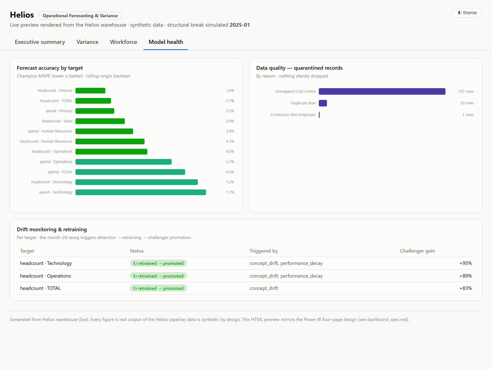

# Power BI layer (Phase 8)

The BI layer over the Helios warehouse: a semantic model, a DAX measure
library, a four-page dashboard design, and a live HTML preview rendered from the
same warehouse Power BI reads.

## What's here

| File | What it is |
|---|---|
| [`dax_measures.md`](dax_measures.md) | Every DAX measure, with the reasoning — incl. the **semi-additive headcount** handling |
| [`dashboard_spec.md`](dashboard_spec.md) | The four-page design: visuals, measures, and the question each page answers |
| `build_dashboard.py` | Renders `dashboard.html` from the live warehouse + `data/reports/` |
| `export_model.py` | Dumps the star schema to `model/*.csv` for Power BI Desktop |
| `_dashboard_template.html` | Self-contained HTML/SVG template (no external libs) |
| `screenshots/` | Rendered pages (below) |

## The four pages

Rendered from the live warehouse — every number is real pipeline output on
synthetic data.

### Executive summary


### Variance


### Workforce


### Model health


## Build the preview

```
python -m src.warehouse         # ensure the warehouse is loaded
python -m src.forecasting --no-prophet --no-mlflow   # backtest report
python -m src.monitoring        # drift report
python -m powerbi.build_dashboard   # -> powerbi/dashboard.html
```

Open `dashboard.html` in any browser. It is fully self-contained (inline SVG,
no CDN), theme-aware, and interactive (hover tooltips, page tabs).

## Build the actual .pbix

The HTML above is a faithful preview; the production artifact is a Power BI
Desktop file. To build it:

**First, export the model** so there is no database connection to configure:

```
python -m src.warehouse            # ensure the warehouse is loaded
python -m powerbi.export_model     # -> powerbi/model/*.csv (10 tables)
```

Then, in Power BI Desktop (~20 minutes):

1. **Get Data → Folder →** select `powerbi/model` → **Combine & Load**. All ten
   tables arrive with ISO dates, so no locale-dependent date parsing.
2. **Model view**: single-direction relationships (dimension → fact) on the
   `*_key` columns; mark `dim_date` as the date table.
3. **Add the measures** from [`dax_measures.md`](dax_measures.md) verbatim.
4. **Build the four pages** per [`dashboard_spec.md`](dashboard_spec.md).
5. Hide raw `*_fte` columns so headcount is only ever surfaced through the
   semi-additive measures.

> `model/` is gitignored — it is derived from the seed like everything else in
> `data/`, so it is regenerated rather than committed.

> Power BI Desktop is Windows-only and GUI-driven, so the `.pbix` is assembled
> there rather than generated by this repo. The DAX, the semantic model, and the
> data are the real work and live here; the preview shows exactly what the
> report renders.
